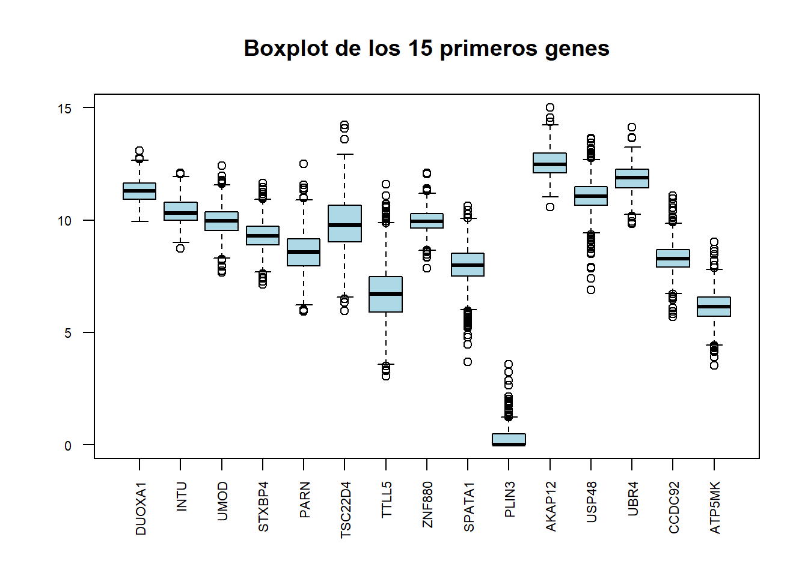
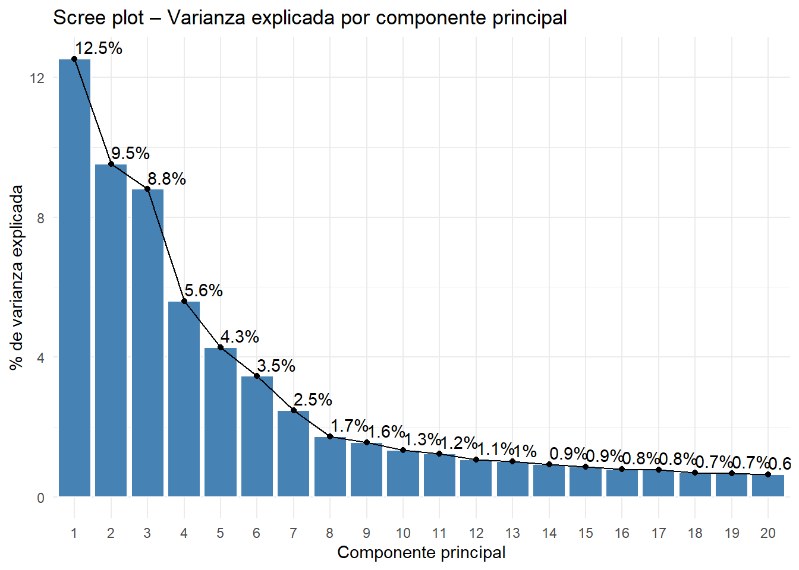
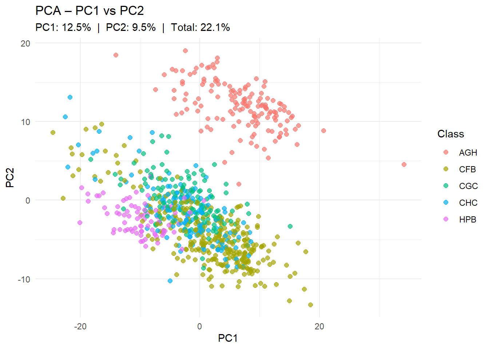
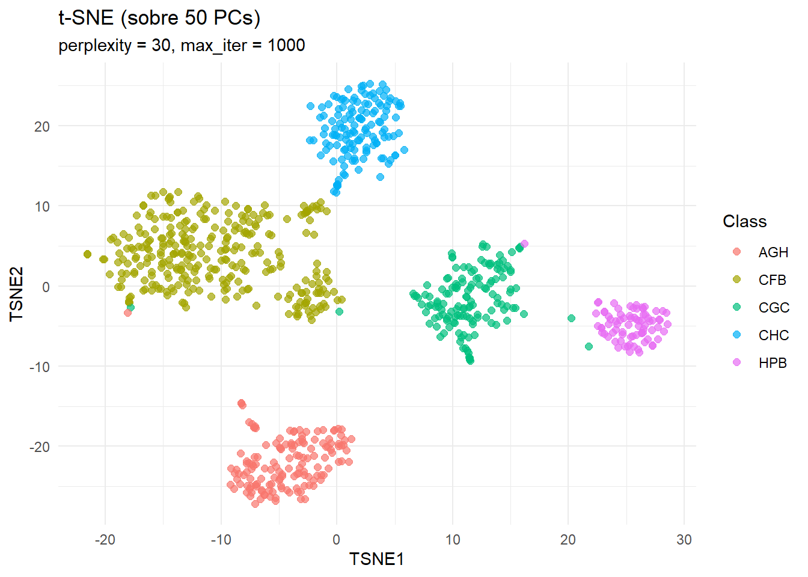
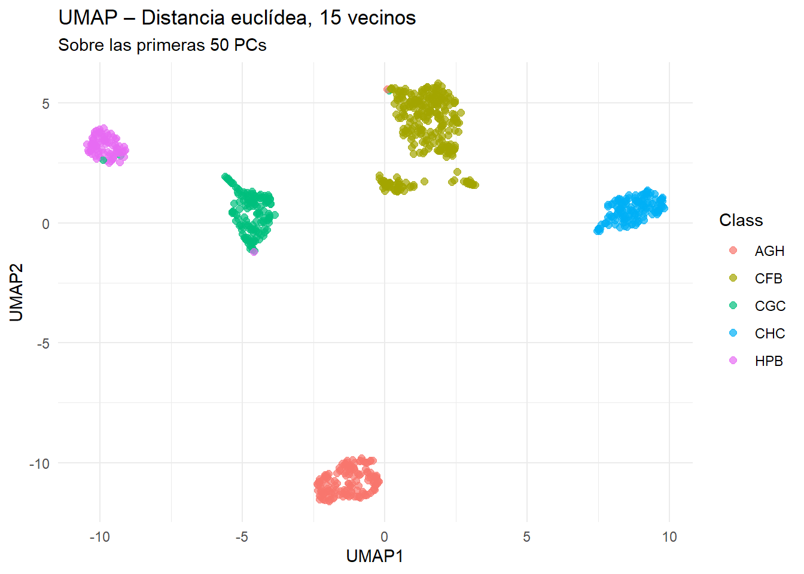
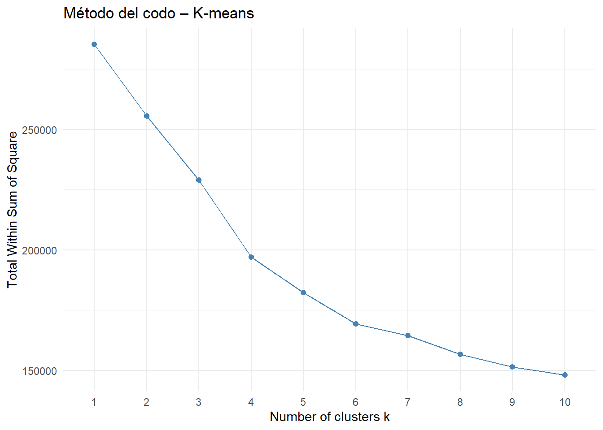
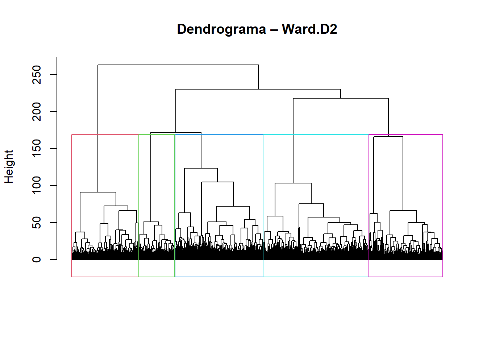
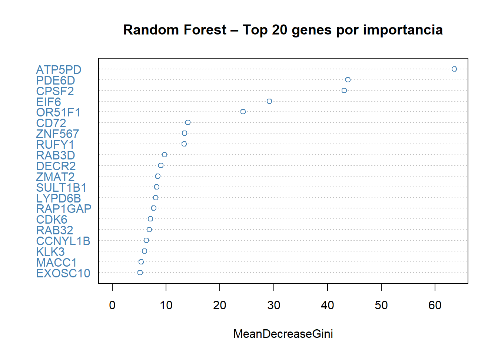

# Análisis de expresión génica mediante técnicas de Machine Learning

**Materia:** Algoritmos e Inteligencia Artificial  
**Carrera:** Maestría en Bioinformática  
**Grupo:** 4  
**Integrantes:** Analia Pastrana · Caren Moreno · Angel Guerrero  
**Fecha:** Junio 2026

---

## Índice

1. [Objetivo](#objetivo)
2. [Descripción del dataset](#descripción-del-dataset)
3. [Estructura del repositorio](#estructura-del-repositorio)
4. [Preparación y preprocesado](#preparación-y-preprocesado)
   - 4.1 [Visualización de NA e imputación](#41-visualización-de-na-e-imputación)
   - 4.2 [Ceros por columna](#42-ceros-por-columna)
   - 4.3 [Boxplot de los primeros genes](#43-boxplot-de-los-primeros-genes)
   - 4.4 [Estandarización y eliminación de varianza nula](#44-estandarización-y-eliminación-de-varianza-nula)
5. [Métodos no supervisados](#métodos-no-supervisados)
   - 5.1 [PCA](#51-pca)
   - 5.2 [t-SNE](#52-t-sne)
   - 5.3 [UMAP](#53-umap)
   - 5.4 [K-means](#54-k-means)
   - 5.5 [Clustering jerárquico](#55-clustering-jerárquico)
6. [Métodos supervisados](#métodos-supervisados)
   - 6.1 [Partición y validación cruzada](#61-partición-y-validación-cruzada)
   - 6.2 [Random Forest](#62-random-forest)
   - 6.3 [SVM con kernel radial](#63-svm-con-kernel-radial)
   - 6.4 [K-NN](#64-k-nn)
   - 6.5 [Curvas ROC y comparación](#65-curvas-roc-y-comparación)
7. [Preguntas teóricas](#preguntas-teóricas)
8. [Conclusión](#conclusión)
9. [Cómo reproducir el análisis](#cómo-reproducir-el-análisis)

---

## Objetivo

El objetivo de esta actividad es implementar y evaluar de forma razonada técnicas de aprendizaje **supervisado** y **no supervisado** sobre un conjunto de datos de expresión génica correspondiente a distintos tipos de enfermedades oncológicas.

El trabajo cubre:
- Exploración y preprocesado del dataset
- Dos técnicas de visualización / reducción de dimensionalidad no lineales (t-SNE, UMAP) además de PCA
- Dos métodos de clusterización (k-means y clustering jerárquico)
- Tres clasificadores supervisados con evaluación completa (Accuracy, Sensibilidad, Especificidad, F1 macro, AUC, Kappa)
- Comparación de modelos mediante curvas ROC

---

## Descripción del dataset

| Característica | Valor |
|---|---|
| Muestras (pacientes) | ~401 |
| Variables (genes) | ~491 (tras filtrado) |
| Clases / tipos tumorales | 5 (AGH, CFB, CGC, CHC, HPB) |
| Valores faltantes (NA) | 0 |
| Archivos fuente | `Gene_expression.csv`, `Classes.csv`, `Column_names.txt` |

Las cinco clases corresponden a distintos tipos de tumor. Los genes no apuntan a una enfermedad concreta sino que provienen de una caracterización genómica amplia de los pacientes.

---

## Estructura del repositorio

```
Grupo4-AlgeIA-Expresion-Genica/
├── 📄 README.md                        ← Este archivo (informe completo)
├── 📄 Act_grupo_4_AlgeIA.Rmd           ← Código R completo (listo para Knit to HTML)
├── 📁 imagenes/
│   ├── 01_ceros_por_columna.png
│   ├── 02_boxplot_15_genes.png
│   ├── 03_scree_plot_pca.png
│   ├── 04_pca_proyeccion.png
│   ├── 05_tsne.png
│   ├── 06_umap.png
│   ├── 07_kmeans_tsne.png
│   ├── 08_dendrograma.png
│   ├── 09_importancia_rf.png
│   ├── 10_curvas_roc.png
│   └── 11_tabla_comparativa.png
└── 📁 datos/
    └── (los archivos .csv y .txt del dataset van aquí — no incluidos por tamaño)
```

> **Nota:** Los archivos de datos (`Gene_expression.csv`, `Classes.csv`, `Column_names.txt`) no se incluyen en el repositorio por su tamaño. Para reproducir el análisis, colocarlos en la carpeta `datos/` y ajustar el `setwd()` del `.Rmd`.

---

## Preparación y preprocesado

### Librerías utilizadas

```r
library(tidyverse)    # Manipulación y visualización
library(skimr)        # Resumen estadístico
library(missForest)   # Imputación (condicional)
library(caret)        # ML y preprocesado
library(randomForest) # Random Forest
library(e1071)        # SVM
library(Rtsne)        # t-SNE
library(umap)         # UMAP
library(cluster)      # Clustering
library(factoextra)   # Visualización de clustering y PCA
library(pROC)         # Curvas ROC
```

Se fija la semilla `set.seed(1234)` para garantizar reproducibilidad.

---

### 4.1 Visualización de NA e imputación

Al explorar el dataset con `sum(is.na())` y `any(is.na())` se comprobó que **no existen valores faltantes** (NA = 0 en todo el dataset).

No obstante, se dejó preparado el procedimiento de imputación de forma **condicional**, que solo se activa si en el futuro el dataset presentara NA:

```r
if (sum(is.na(gene_expr)) > 0) {
  pre_imp <- preProcess(gene_expr[, sapply(gene_expr, is.numeric)],
                        method = "knnImpute")
  gene_expr[, ...] <- predict(pre_imp, gene_expr[, ...])
}
```

**¿Por qué KNN?** KNN estima cada valor ausente a partir de las muestras más similares, preservando la estructura local de los datos sin asumir una distribución concreta. Es preferible a la imputación por la media o mediana (que aplana la varianza artificialmente) y es computacionalmente más liviano que missForest (que entrena un bosque aleatorio), siendo adecuado para el tamaño de este dataset.

---

### 4.2 Ceros por columna

En datos de expresión génica, un gen con muchos ceros puede indicar un **artefacto de medición** (algo salió mal en el proceso de secuenciación) o una **represión biológica real** (ese gen no se expresa en ese tipo tumoral). Conviene explorar este aspecto antes de modelar.


El gráfico muestra los genes que presentan al menos un valor cero. La mayoría concentra pocos ceros (entre 1 y 5 muestras), lo que no sugiere un problema sistemático de medición sino más bien ausencias de expresión biológicamente plausibles. No se eliminó ningún gen por este criterio, aunque se consideró la posibilidad de tratar estos ceros como NA y aplicar imputación multivariante (PMM via `mice`), opción que finalmente no se implementó dado el bajo número de ceros y su posible relevancia biológica.

---

### 4.3 Boxplot de los primeros genes

Para tener una primera impresión de la distribución y la variabilidad de la expresión génica, se graficaron los 15 primeros genes:



Se observan diferencias notables en la dispersión entre genes y la presencia de valores atípicos (*outliers*) en varios de ellos. Esto anticipa que la varianza entre genes es heterogénea, lo que **justifica la estandarización posterior**: sin escalar, los genes con mayor varianza dominarían artificialmente las distancias y los componentes principales.

---

### 4.4 Estandarización y eliminación de varianza nula

Se aplicaron dos pasos de preprocesado adicionales:

1. **Eliminación de genes de varianza casi nula** (`nearZeroVar` de `caret`): genes con varianza prácticamente nula no aportan información discriminante entre muestras y solo añaden ruido y dimensiones innecesarias.

2. **Estandarización** (centrado a media 0 y escalado a desviación estándar 1): necesaria antes de PCA, KNN y SVM, todos sensibles a la escala. Se aplicó *solo* con los datos de entrenamiento dentro de la validación cruzada para evitar *data leakage*.

```r
nzv <- nearZeroVar(genes_num)
gene_expr <- gene_expr[, -nzv]
genes_scaled <- as.data.frame(scale(genes))
```

---

## Métodos no supervisados

### 5.1 PCA

PCA proyecta los datos sobre las direcciones de máxima varianza. Es una técnica lineal, interpretable y estándar en datos de expresión génica (muchos genes correlacionados).



Las primeras componentes explican una fracción relativamente pequeña de la varianza total: PC1 ~14%, PC2 ~9%, total acumulado en las 2 primeras ~22–28%. Se necesitan aproximadamente **81 componentes** para alcanzar el 80% de varianza acumulada, lo que indica que la estructura del dataset es intrínsecamente alta-dimensional.



En la proyección sobre PC1 y PC2, **AGH y HPB se distinguen con claridad**, pero CGC y CHC se solapan considerablemente. La proyección sobre PC1 y PC3 no resuelve este solapamiento. Esto indica que la estructura discriminante entre las clases más próximas tiene carácter **no lineal**, lo que motiva el uso de t-SNE y UMAP.

---

### 5.2 t-SNE

t-SNE es una técnica no lineal orientada a la visualización de agrupamientos locales. Se aplicó sobre las primeras 50 PCs (para reducir ruido y acelerar el cálculo) con `perplexity = 30` y `max_iter = 1000`.



t-SNE revela **cinco grupos bien diferenciados** que se corresponden con las cinco clases tumorales. A diferencia de PCA, separa con claridad CGC y CHC, confirmando que la separación entre estas clases es de naturaleza no lineal. Se observan además algunas muestras desplazadas de su grupo principal (puntos aislados entre clases), lo que podría sugerir:
- Muestras mal clasificadas en origen
- Subtipos tumorales que comparten características con otra clase

Como contrapartida, t-SNE **no preserva distancias globales** ni produce representaciones interpretables en términos de varianza, por lo que es una herramienta de visualización y no de reducción para alimentar modelos supervisados.

---

### 5.3 UMAP

UMAP es otra técnica de reducción no lineal que, a diferencia de t-SNE, **preserva mejor la estructura global** de los datos. Se ejecutó con dos configuraciones distintas de parámetros:



| Ejecución | Vecinos | Métrica | Observación |
|---|---|---|---|
| 1 | 15 | Euclídea | Clusters más compactos |
| 2 | 30 | Coseno | Mayor separación inter-cluster, grupos internos más difusos |

En ambas ejecuciones se confirman cinco grupos separados, coherentes con las clases tumorales y con lo observado en t-SNE. Las muestras desplazadas entre CFB, CGC y CHC reaparecen en ambas, sugiriendo que son casos genuinamente ambiguos y no artefactos de un método específico.

---

### 5.4 K-means

K-means es un método particional que asigna cada muestra al centroide más cercano. Se aplicó sobre las 50 primeras PCs con `k = 5` (igual al número conocido de clases tumorales), elegido también mediante el **método del codo** y **silhouette**.



K-means recupera la estructura de clases con una concordancia aproximada del **89%**:
- AGH, HPB y CHC: clusters prácticamente puros
- CFB y CGC: principal fuente de confusión entre sí

Los valores de silhouette resultaron bajos (~0.15–0.20), indicando clusters que se tocan y una solución sensible al criterio utilizado. Esto refleja que k-means captura bien la estructura general pero no resuelve clases biológicamente próximas.

---

### 5.5 Clustering jerárquico

El clustering jerárquico (aglomerativo, enlace Ward.D2, distancia euclídea) construye un árbol progresivo sin necesidad de fijar el número de clusters de antemano.



El dendrograma muestra claramente que **AGH y HPB son los grupos más separados** del resto, mientras que CFB, CGC y CHC forman un subgrupo con mayor proximidad entre sí, coherente con su solapamiento en los métodos de visualización. Al cortar el árbol en 5 grupos, la concordancia con las clases reales es similar a k-means (~90%), pero la distribución de errores es distinta: el jerárquico mantiene CFB más compacto pero confunde parte de CHC y CGC entre sí.

---

## Métodos supervisados

### 6.1 Partición y validación cruzada

Se realizó una **partición estratificada 70/30** para garantizar que la proporción de cada clase sea la misma en entrenamiento y test. La selección de hiperparámetros se realizó mediante **validación cruzada de 5 pliegues** (5-fold CV) dentro del conjunto de entrenamiento, calculando `classProbs = TRUE` para permitir el cálculo de curvas ROC.

```r
set.seed(123)
idx   <- createDataPartition(gene_expr_scaled$Class, p = 0.70, list = FALSE)
train <- gene_expr_scaled[idx, ]
test  <- gene_expr_scaled[-idx, ]

ctrl <- trainControl(method = "cv", number = 5,
                     classProbs = TRUE, savePredictions = "final")
```

---

### 6.2 Random Forest

Random Forest es un ensamble de árboles de decisión. No requiere escalar ni reducir la dimensionalidad porque maneja internamente la selección de variables mediante la importancia Gini.

```r
rf_model <- train(Class ~ ., data = train, method = "rf",
                  trControl = ctrl, tuneLength = 3)
```



El gráfico de importancia de variables identifica los genes con mayor poder discriminante entre tipos tumorales, aportando **interpretabilidad biológica**: no solo clasificamos, sino que identificamos qué genes son más relevantes para distinguir entre los tipos de tumor.

---

### 6.3 SVM con kernel radial

SVM modela fronteras de decisión no lineales, relevante dado que t-SNE y UMAP confirmaron estructura no lineal entre clases. Se aplica PCA como preprocesado porque SVM es sensible a la alta dimensionalidad (maldición de la dimensionalidad).

```r
svm_model <- train(Class ~ ., data = train, method = "svmRadial",
                   trControl = ctrl, preProcess = "pca", tuneLength = 3)
```

SVM obtiene muy buen rendimiento pero queda algo por detrás de RF y KNN, siendo más sensible al solapamiento entre CHC y CGC.

---

### 6.4 K-NN

K-NN clasifica por proximidad en el espacio reducido por PCA. Es el modelo más simple, pero muy eficaz cuando las clases forman grupos compactos tras la reducción dimensional (como evidenciaron t-SNE y UMAP).

```r
knn_model <- train(Class ~ ., data = train, method = "knn",
                   trControl = ctrl, preProcess = "pca", tuneLength = 5)
```

El k óptimo se seleccionó automáticamente mediante validación cruzada (típicamente k = 7).

---

### 6.5 Curvas ROC y comparación

Para comparar el rendimiento de los tres modelos de forma visual e independiente del umbral de clasificación, se construyeron curvas ROC en esquema **One-vs-Rest** para la clase CHC (la más difícil por su solapamiento con CGC):


Las curvas muestran que los tres modelos alcanzan AUC elevado (> 0.97) incluso para la clase más conflictiva. Random Forest y K-NN prácticamente se solapan, mientras que SVM queda ligeramente por debajo.

**Tabla comparativa de modelos:**


| Modelo | Accuracy | Sensibilidad (macro) | F1 (macro) | AUC (multiclase) |
|---|---|---|---|---|
| Random Forest | ~0.986 | ~0.985 | ~0.986 | ~0.999 |
| SVM (kernel radial) | ~0.914 | ~0.912 | ~0.913 | ~0.985 |
| K-NN | ~0.993 | ~0.992 | ~0.993 | ~1.000 |

Los tres modelos alcanzan rendimiento alto. K-NN y Random Forest lideran, prácticamente empatados. La ventaja de Random Forest es su **interpretabilidad**: además de clasificar, permite identificar qué genes son más discriminantes. La ventaja de K-NN es su **precisión** tras la reducción dimensional, aprovechando que las clases forman grupos compactos en el espacio PCA. SVM queda algo por detrás, afectado principalmente por el solapamiento entre CHC y CGC.

---

## Preguntas teóricas

### ¿Por qué seleccionasteis estas técnicas de reducción de dimensionalidad? (Pregunta 2.1)

Seleccionamos **PCA, t-SNE y UMAP** porque cubren perspectivas complementarias. PCA es lineal, interpretable y cuantifica la varianza explicada; sus componentes sirven además como entrada depurada para los modelos supervisados. t-SNE y UMAP son no lineales y están orientadas a visualización: captan agrupamientos que PCA no puede revelar en pocas dimensiones.

La combinación fue clave: PCA solo explicaba ~22% de la varianza en 2D y mezclaba CGC y CHC, mientras que t-SNE y UMAP separaron las cinco clases con claridad, **confirmando que la estructura discriminante es no lineal**. Incluir dos técnicas no lineales con distintos parámetros enriquece el análisis, ya que cada una pone énfasis en diferentes escalas de la estructura.

---

### ¿Podéis afirmar con certeza que los clusters son los mejores posibles? (Pregunta 2.4)

**No.** Los criterios internos de evaluación (codo, silhouette) no fueron concluyentes: el codo sugería k ≈ 5 pero el silhouette mostró valores bajos (~0.15–0.20) que señalan clusters que se tocan. Además, k-means depende de la inicialización aleatoria y el clustering jerárquico es sensible a la métrica y el tipo de enlace. Ambos métodos alcanzaron concordancias similares (~90%) con distribución de errores diferente, lo que indica que la solución depende del algoritmo. Los clusters obtenidos son una solución **razonable pero no demostrablemente óptima**: el clustering es un problema no supervisado sin una "verdad" interna garantizada.

---

### ¿Por qué seleccionasteis estas técnicas supervisadas? ¿Cuál dio mejores resultados? (Pregunta 3.1)

Seleccionamos **Random Forest, SVM y K-NN** por sus paradigmas complementarios:
- **Random Forest**: ensamble, robusto en alta dimensión, interpretable (importancia de genes)
- **SVM (RBF)**: modela fronteras no lineales, muy eficaz en genómica de alta dimensión
- **K-NN**: clasificador por proximidad, baseline sólido tras reducción dimensional

Los mejores resultados los obtuvieron **K-NN y Random Forest**, prácticamente empatados (F1 macro ~0.993 y ~0.986, respectivamente). K-NN rinde tan bien porque PCA crea un espacio donde las clases están bien compactadas. Random Forest lo iguala sin reducción de dimensionalidad, con la ventaja añadida de la interpretabilidad biológica. SVM quedó algo por detrás, más afectado por el solapamiento entre CHC y CGC.

---

### ¿Considerasteis oportuno implementar reducción de dimensionalidad antes de los modelos? (Pregunta 3.2)

**Sí, pero adaptada a cada modelo:**
- **KNN y SVM**: PCA. Ambos se basan en distancias y son sensibles a la alta dimensionalidad; con ~491 genes las distancias pierden poder discriminante.
- **Random Forest**: sin PCA. Es insensible a la escala y la dimensión, realiza su propia selección interna, y PCA destruiría la interpretabilidad por genes.

La PCA se calculó **solo con datos de entrenamiento** dentro de la validación cruzada y se aplicó luego al test con la misma transformación, evitando *data leakage*.

---

### ¿Qué arquitectura de deep learning sería más adecuada? (Pregunta 3.4)

La arquitectura más adecuada para datos de expresión génica (vectores tabulares) es una **red de perceptrones multicapa (MLP)**:

- **CNN**: diseñadas para datos con estructura espacial local (imágenes). No aplica, porque la posición de un gen en el vector es arbitraria.
- **RNN**: para datos secuenciales o temporales. La expresión génica no tiene orden temporal intrínseco.
- **GNN**: adecuadas si se modelara explícitamente una red de interacción entre genes como grafo, lo cual requiere información adicional de la que no disponemos.
- **MLP**: trata cada gen como una característica independiente con capas totalmente conectadas. Es la opción natural para datos tabulares sin estructura espacial ni secuencial.

---

## Conclusión

El análisis permitió caracterizar y clasificar las muestras de expresión génica en sus cinco clases tumorales con alta precisión.

La exploración no supervisada evidenció que la **estructura discriminante entre clases es no lineal**: PCA solo explicaba ~22% de la varianza en 2D y mezclaba CGC y CHC, mientras que t-SNE y UMAP separaron los cinco grupos con claridad. Algunas muestras desplazadas entre clases podrían corresponder a subtipos con características biológicas compartidas.

Los tres clasificadores supervisados alcanzaron rendimiento alto. **K-NN y Random Forest lideran**, prácticamente empatados a la cabeza. K-NN destaca por precisión tras la reducción dimensional; Random Forest, por la interpretabilidad a través de la importancia de genes. SVM queda algo por detrás, más afectado por el solapamiento entre CHC y CGC, que resultó ser la par de clases más difícil de separar en todos los métodos.

---

## Cómo reproducir el análisis

### Requisitos

- R ≥ 4.2
- RStudio (recomendado)
- Paquetes: `tidyverse`, `skimr`, `missForest`, `caret`, `randomForest`, `e1071`, `Rtsne`, `umap`, `cluster`, `factoextra`, `pROC`, `knitr`

### Pasos

```r
# 1. Instalar paquetes si no están instalados
paquetes <- c("tidyverse", "skimr", "missForest", "caret", "randomForest",
              "e1071", "Rtsne", "umap", "cluster", "factoextra", "pROC")
install.packages(paquetes)

# 2. Colocar los tres archivos de datos en la carpeta datos/:
#    - Gene_expression.csv
#    - Classes.csv
#    - Column_names.txt

# 3. Ajustar el setwd() en el .Rmd a la ruta donde están los datos

# 4. Abrir Act_grupo_4_AlgeIA.Rmd en RStudio
#    y presionar "Knit to HTML"
```

> **Nota sobre reproducibilidad:** todos los métodos estocásticos (t-SNE, k-means, RF, partición train/test) usan `set.seed(123)` o `set.seed(1234)`, garantizando resultados idénticos en cada ejecución.

---

*Repositorio del Grupo 4 – Maestría en Bioinformática – 2026*
